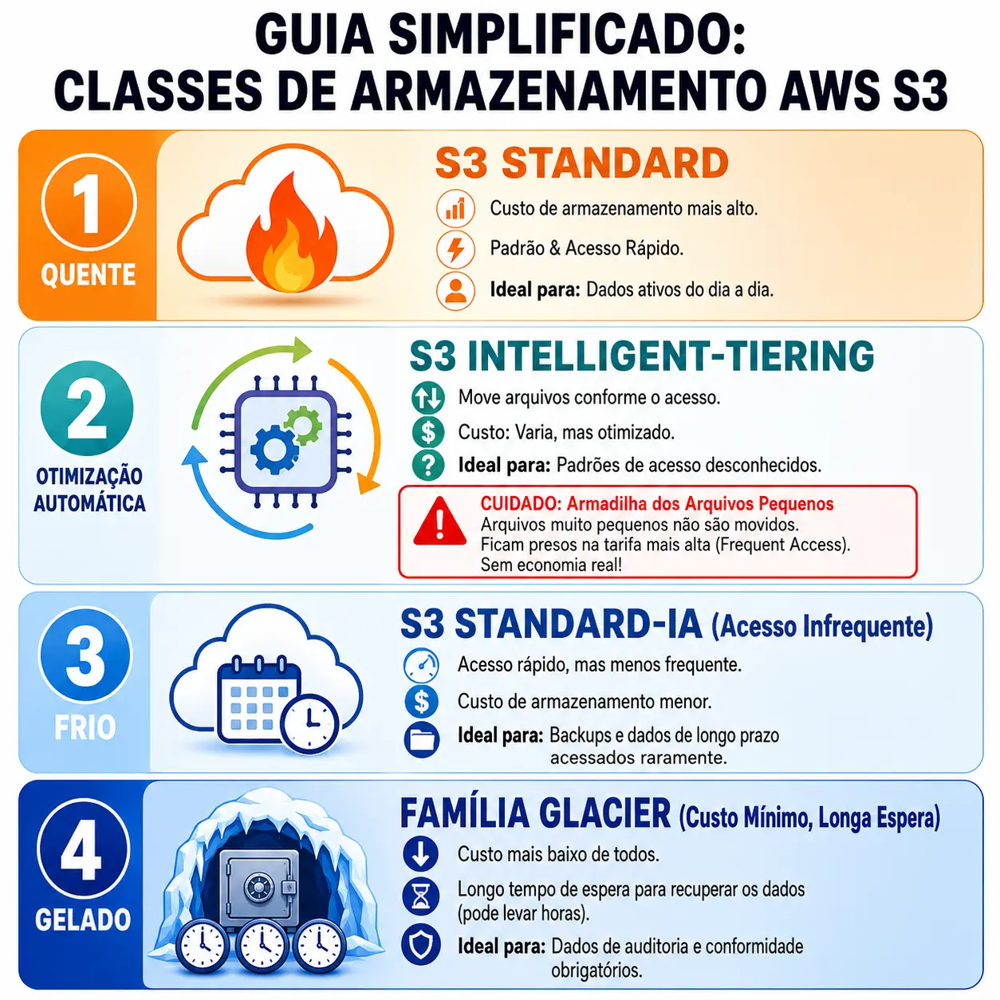

A nuvem não é mágica, ela é infraestrutura alugada. E se você não entende as regras do contrato de aluguel, a fatura no final do mês não perdoa.

Durante muito tempo na minha jornada como desenvolvedor backend, confesso que criei rotinas de upload de arquivos no S3 no "piloto automático". Instanciamos o SDK da AWS, enviamos o buffer e seguimos em frente. O arquivo cai no **S3 Standard**, a classe padrão, e a vida continua.

Mas, ao mergulhar na arquitetura de soluções para escalar aplicações com responsabilidade financeira, fica claro que conhecer a fundo as **Storage Classes (Classes de Armazenamento)** muda completamente o jogo. Não se trata apenas de onde guardar o arquivo, mas de projetar estrategicamente o ciclo de vida dessa informação na nuvem.



O S3 Standard é excelente para "dados quentes" e de acesso diário, mas raramente é a melhor opção a longo prazo. É para isso que existem outras classes focadas em otimização. O maior perigo, no entanto, ironicamente está na classe que promete automatizar a sua economia.

## A Falsa Promessa do Intelligent-Tiering

A AWS lançou o **S3 Intelligent-Tiering** como a bala de prata para dados com padrões de acesso desconhecidos. A premissa é fantástica: a AWS monitora seus objetos e, se ninguém acessá-los por 30 dias, move os arquivos automaticamente para uma Storage Class mais barata (como a Infrequent Access). Se não acessarem por 90 dias, vai para a classe Archive, e assim por diante.

Parece o cenário perfeito para ligar e esquecer, certo? **Errado.**

Existe uma regra escrita nas letras miúdas da documentação de _Pricing_ da AWS que é uma verdadeira armadilha arquitetural: **objetos menores que 128 KB não são elegíveis para a transição automática de economia.**

### O Impacto no Mundo Real (Node.js & Go)

Imagine que você projetou uma arquitetura orientada a eventos. Você tem microsserviços em Node.js ou workers em Go salvando constantemente pequenos arquivos no S3:

- Payloads de eventos (arquivos JSON de 5KB a 20KB).
- Logs transacionais de aplicações.
- Pequenos arquivos de configuração ou _feature toggles_.
- Thumbnails de imagens.

Se você ativar o Intelligent-Tiering para um _bucket_ cheio desses arquivos microscópicos, a AWS **não** cobrará a taxa de monitoramento por eles. No entanto, ela **nunca** os moverá para as camadas mais baratas. Eles ficarão congelados eternamente na tarifa mais cara (Frequent Access), implodindo a sua estratégia de otimização. Você acha que está economizando, mas está pagando o valor premium.

## O Que Diferencia um Arquiteto de um Usuário Padrão

Para não cair nessa armadilha, a solução não é abandonar a otimização, mas aplicar engenharia de dados e dominar as outras Storage Classes através do **S3 Lifecycle Rules (Regras de Ciclo de Vida)**.

Em vez de delegar a decisão cegamente para a AWS, um bom Tech Lead mapeia o cenário real para as classes corretas:

1. **S3 Standard-IA (Infrequent Access):** A escolha cirúrgica para backups de bancos de dados estruturados. O acesso é raríssimo, mas se uma tabela corromper e o RTO (Recovery Time Objective) precisar ser imediato, o Standard-IA te entrega o arquivo em milissegundos, custando muito menos no fim do mês.
2. **S3 Glacier Flexible Retrieval:** A geladeira de dados. Excelente para relatórios antigos. Você paga muito pouco, mas precisa aceitar um tempo de recuperação que varia de minutos a horas.
3. **S3 Glacier Deep Archive:** O "fundo do mar" da AWS. Feito para retenção obrigatória de auditoria (compliance). É o armazenamento mais barato possível, mas "descongelar" um arquivo aqui pode levar mais de 12 horas.

## A Solução Definitiva: Lifecycle Policies Híbridas

A arquitetura correta exige regras direcionadas combinando essas diferentes classes. No seu painel da AWS (ou no seu código de IaC, como Terraform), você pode configurar regras baseadas em **prefixos** (pastas):

- **Regra 1:** Tudo que estiver com o prefixo `/logs` ou `/events` (arquivos minúsculos) transiciona direto do _Standard_ para o _Glacier Flexible Retrieval_ após 30 dias (ignorando o Intelligent-Tiering).
- **Regra 2:** Tudo que estiver no prefixo `/media` (arquivos pesados e imagens grandes) vai para o _Intelligent-Tiering_, onde os arquivos maiores que 128KB vão de fato gerar economia real.

```json
{
  "Rules": [
    {
      "ID": "MoveLogsToGlacier",
      "Prefix": "logs/",
      "Status": "Enabled",
      "Transitions": [
        {
          "Days": 30,
          "StorageClass": "GLACIER"
        }
      ]
    }
  ]
}
```

<ProductCard index={0} />
